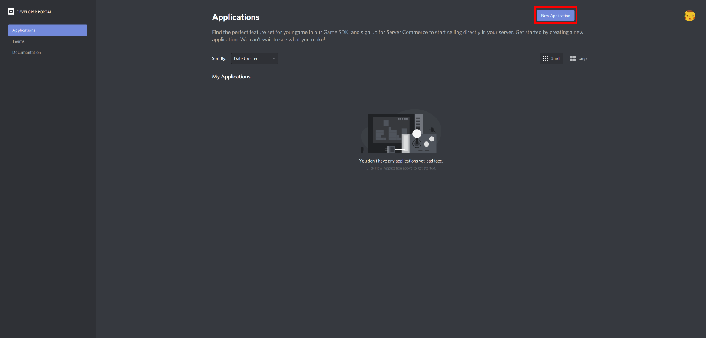

### Creating the bot

Firstly log in at the Discord developer portal which can be found [clicking here](https://discord.com/developers/applications).

After that click the **New Application** button

Choose a name and click in the application.

Now go to the **Bot** tab and select **Add Bot**.

Once you're done with that lets go to the next step.
