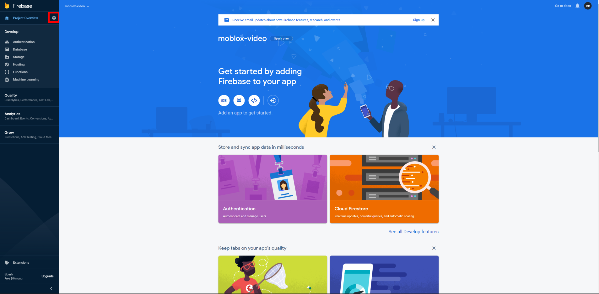

# Create a firebase project and setup the database.

# Creating the project

Firstly log in on Firebase which can be found [clicking here](https://firebase.google.com/).

After that click the **Create a project** button

Choose a name, click next until you are in the dashboard.

# Getting a service account info notepad

Now go to the **Settings** tab.

Select **Project setting** and go to **Service Accounts**.

After that download the service account notepad and keep it as we will need it later.

# Database

Now go back to the Firebase dashboard and select **Database**.

Click **Create database** and press Done until you are inside the dashboard.

After you are inside click **Start collection** and put the following order of names.

Put the collection name **cookies**. The document name **cookie**. And the Field name **key** and as string.

After you created your collection, document and field click the **key** value and put your Roblox cookie. Need help getting it? [Click here!](https://www.youtube.com/watch?v=zHODmGst480)

You are done with the Firebase part after this. Lets go to the Heroku Hosting part.

[Go back](../README.md) | [Next step](./docs/heroku.md)
