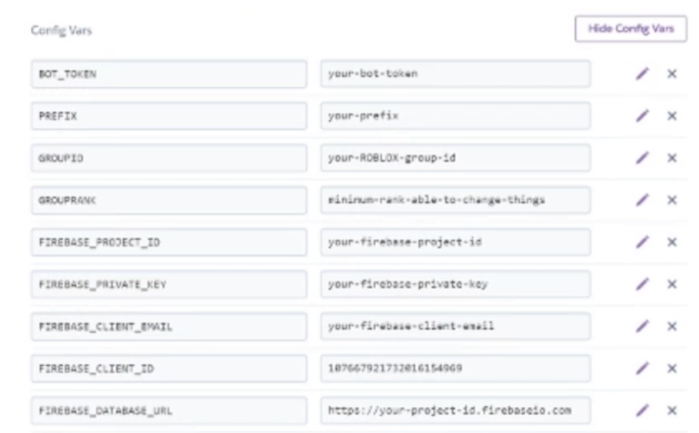

# Heroku Hosting

Learn how to actually make your bot works

# Create a account

You will create a Heroku account before anything

# Creating an app and setting up

Go to the right side of the page and click on **New**. Then select **Create new app**.

Give it a name. If the name you are giving has spaces put a -.

After your bot is created head on to **Deploy**.

Now click **Connect to GitHub**.

After that login into GitHub and type your forked repository name.

Click **Search**, if the repository below is the same click **Connect**.

Now, once you are done enable **Automatic Deploys** but do not deploy yet!

# Configuration Variables

After you are done with the part above go to **Settings**.

There you will click **Reveal Config Vars**. Here is where you will need your notepad file!

```
BOT_TOKEN=PUT_HERE_YOUR_DISCORD_BOT_TOKEN_HERE

PREFIX=!

GROUPID=PUT_HERE_YOUR_GROUP_ID

GROUPRANK=PUT_HERE_YOUR_GROUP_RANK

FIREBASE_PROJECT_ID=PUT_HERE_YOUR_FIREBASE_PROJECT_ID

FIREBASE_PRIVATE_KEY=PUT_HERE_YOUR_FIREBASE_SERVICE_ACCOUNT_PRIVATE_KEY

FIREBASE_CLIENT_EMAIL=PUT_HERE_YOUR_FIREBASE_SERVICE_ACCOUNT_CLIENT_EMAIL

FIREBASE_CLIENT_ID=PUT_HERE_YOUR_FIREBASE_SERVICE_ACCOUNT_CLIENT_ID

FIREBASE_DATABASE_URL=PUT_HERE_YOUR_FIREBASE_DATABASE_URL

```

This can all be found at the notepad from Firebase.

Now here is what it should look like. (values are not done in this example just the variables)



If you have any questions join our support serve rby clicking at the 'moblox' logo at [read me](../README.md).
